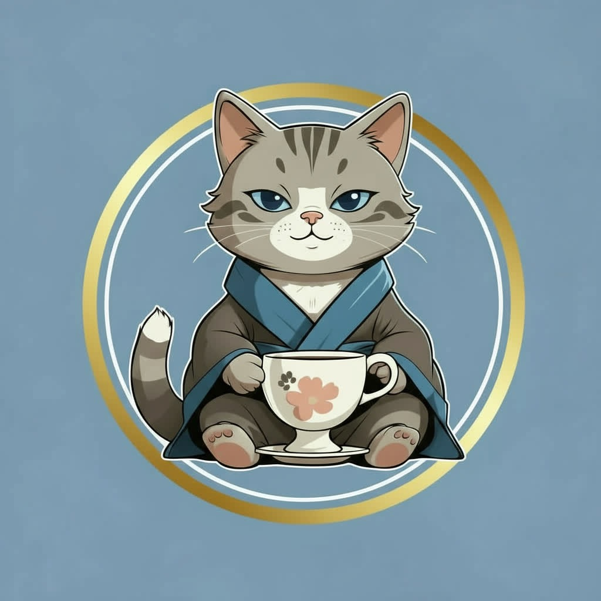

  

<h1 align="center">🧘‍♂️ ZenjiCat</h1>

  The calmest meme on <strong>Base</strong>. 
  A silent guardian of good vibes, anti-rug values, and mindful building. 
  Born from the quiet corners of Zora — built with love, care, and zero noise.

  <a href="concept/vision.md">📜 Vision</a> •
  <a href="concept/lore-teaser.md">🐾 Legend Teaser</a> •
  <a href="visuals/">🎨 Visuals</a>

---

## 👣 What is ZenjiCat?

ZenjiCat is a calm, builder-native memecoin on [Base](https://base.org) —  
created with zero hype, zero VCs, zero dump pressure — just pure intention.  
It exists to:

- 🌱 Reward calm participation  
- 🎨 Showcase mindful creativity  
- 🐾 Create space for builders, not noise  

---

## 🧰 Tech Stack

- **Chain:** Base  
- **Identity:** Base Name (`zenjicat.base.eth`)  
- **Token:** TBA  
- **Visuals:** Handmade, iterative, lo-fi by design  
- **Deployment:** Currently mobile-first (iPhone & iPad), expanding to Mac & PC  

---

## 🔭 Roadmap

### Phase 1 – Base Culture Submission *(Now → Oct 2025)*
- [x] GitHub repo live  
- [x] Zora profiles set up (`takul`, `ZenjiCat`)  
- [x] MetaMask wallet created  
- [x] Base Name `zenjicat.base.eth` registered  
- [ ] Upload key visuals  
- [ ] Finalize README + vision  
- [ ] Submit to Base Batches  

### Phase 2 – Token & Distribution *(Nov–Dec 2025)*
- [ ] Plan $ZENJI token structure  
- [ ] Design fair & organic distribution (Zora-based, community-first)  
- [ ] Meme-claim: no pump, no dump, just peace  

### Phase 3 – Calm Expansion *(2026)*
- [ ] Launch Calmcast (decentralized content flow)  
- [ ] Mintable Lore Series  
- [ ] Open the ZenjiGarden (Farcaster / Lens spaces)  

---

## 💬 Contact

Built by `Takul.eth` 🧘‍♂️  
Zora: [zora.co/takul](https://zora.co/takul) • [zora.co/zenjicat](https://zora.co/zenjicat)  
GitHub: [github.com/takul-eth](https://github.com/takul-eth)  

---

## 📁 Structure

This repo will evolve in phases:

- `/concept`: Lore, vision, narrative  
- `/visuals`: Core brand assets & key visuals  
- `/contracts`: *(future)* Token, minting, claim logic  
- `/meta`: Zora / Frames / metadata JSONs  

Stay tuned.  
Stay calm.  
**Zenji is watching.** 🐾

---

### 📜 Read the first whispers of the Zenji legend
> Calm is the alpha. Onchain is the path.  
[→ The Legend of ZenjiCat (Teaser)](concept/lore-teaser.md)

